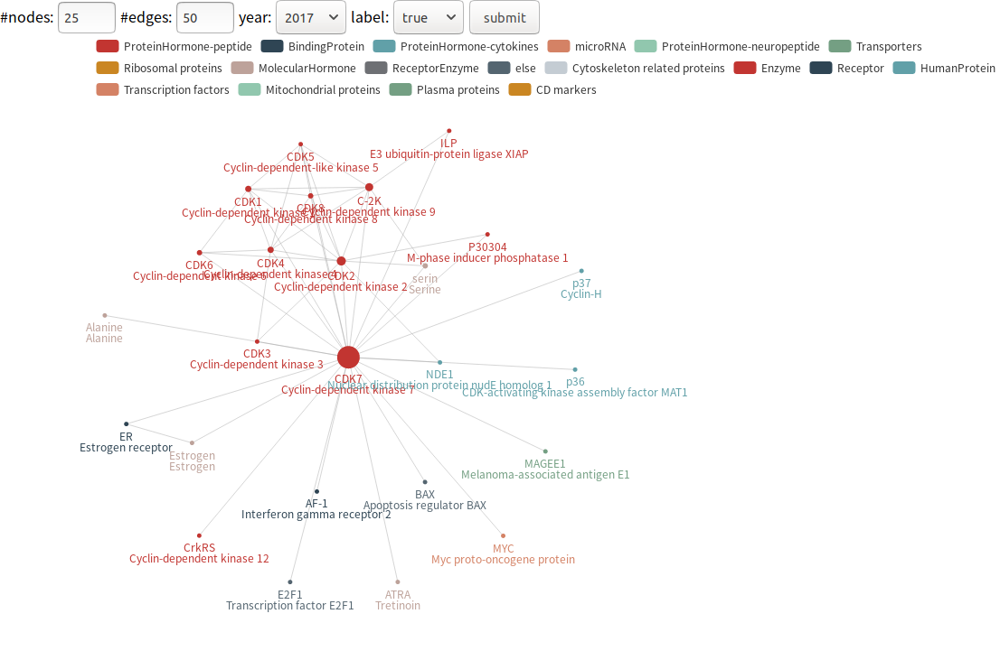
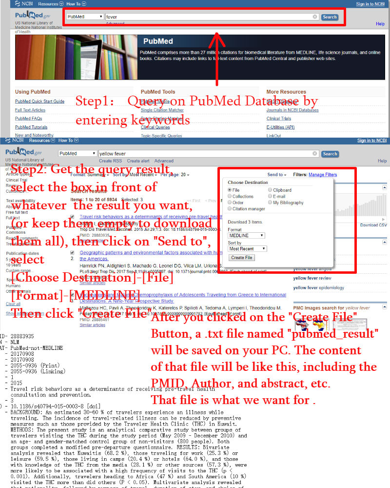


# About us
Fast Review Algorithm -- FRA

check proteins.txt and exclude_names.txt before run FRA program.

http://mathbio.nankai.edu.cn/fra/

# Example Results

PMID	|PublishYear	|ProteinType	|Abb	|EntryName	|NameInAbstract
:-:|:-:|:-:|:-:|:-:|:-:|
29545334	|2018	|Enzyme|	CDK1|	Cyclin-dependent kinase 1	|CDK1
29545334	|2018	|Enzyme	|CDK2	|Cyclin-dependent kinase 2|	CDK2
29545334	|2018|	Enzyme	|CDK5	|Cyclin-dependent-like kinase 5	|CDK5
29545334	|2018	|Enzyme	|CDK7|	Cyclin-dependent kinase 7	|CDK7
29545334	|2018	|Enzyme	|C-2K|	Cyclin-dependent kinase 9|	CDK9
29545334	|2018	|Receptor	|ER	|Estrogen receptor	|ER
29516011	|2018|	else	|CDH2	|Cadherin-2|	CDH2
29516011	|2018	|HumanProtein|	ABCF3|	ATP-binding cassette sub-family F member 3	|ABCF3
29516011	|2018	|CD markers|	Q9NR16	|Scavenger receptor cysteine-rich type 1 protein M160	|CD163L1
29516011	|2018	|Enzyme|	ALDH2	|Aldehyde dehydrogenase, mitochondrial	|ALDH2
29516011	|2018	|Enzyme	|CDK7	|Cyclin-dependent kinase 7	|CDK7
29438694	|2018	|Receptor|	ER|	Estrogen receptor|	Estrogen receptor

---




---
# Run FRA
## run in windows x64

double click "GUI.exe".
>1. please don't set the directory in non-English PATH.
2. sometimes it will throw HTTP error403,  please download medline file manually as below.

---
## run from source code
```bash
python 2.7

help:
    python fra.py -h

fra with local medline file:
    python fra.py -i test/pubmed_result.txt -o test

# This script can download medline file from input "term" if Bio package was installed.
# But, sometimes PubMed will restrict download from script.
# you will get HTTPError 403.
fra(download from term automatically):
    python fra.py -i test2/pubmed_result.txt -o test2 --term "PIM1"
```
---
# Description of network weight
```
if two human proteins exists in the same paper,
then construct an edge between them with publish year label.

weight of a protein(node):
    Y = year
    N = number of papers those have mentioned the protein before Y.
    T = number of mentioned times of all proteins bofore Y.
    Define:
        Weight(protein, Y) = N(Y)/T(Y)
weight of a protein-pair(edge):
    Y = year
    N = number of papers those have mentioned the protein-pair before Y.
    T = number of mentioned times of all protein-pairs bofore Y.
    Define:
        Weight(protein-pair, Y) = N(Y)/T(Y)
```


---

# Check results
>
1. "FRA_result.csv" is the most important result file.
It contains all proteins found in medline file.
2. "web" dir contains  a file named "graph.html", open it and wait. Your browser will show a proteins network.
3. you can set #nodes to 50, that's to show the Top50 highest weight proteins.
4. you can set #edges to 50, that's to show the Top50 highest weight protein-protein edge.
5. you can set year to 2010, that's to show research focus before 2010(include 2010).
6. you can select label to true, that's to show label in networks.
7. Every time you should click "submit" button to reload settings.
8. you can click legend "Enzyme", that means do not show "Enzyme" in networks.

---
# Download MEDLINE manually



---

# About Gephi

If you want to display the protein network using gephi, then read the content below.
[download Gephi](https://gephi.org/users/download/)
```
before install gephi, you should install jdk.
gephi8.*.csv are for gephi0.8* version.
```
[how to construct dynamic networks using gephi ](http://mathbio.nankai.edu.cn/fra/video.html)


